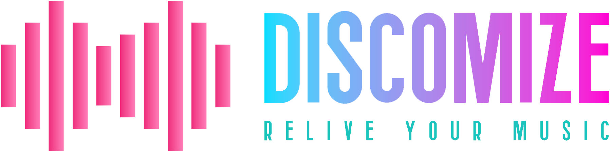

# DiscoMize

Discover your favorites, remember forgotten gems and relive your musical history.

DiscoMize requires a Spotify account, and needs access to your playback data. DiscoMize is a client-only app and no data is stored or transmitted.

## Spotify API

DiscoMize uses following Spotify Experiences:

- [Authorization](https://developer.spotify.com/documentation/general/guides/authorization-guide/#implicit-grant-flow)
- [Get Users Top Tracks and Artists](https://developer.spotify.com/documentation/web-api/reference/personalization/get-users-top-artists-and-tracks/)
- [Get Recently Played tracks for user](https://developer.spotify.com/documentation/web-api/reference/player/get-recently-played/)
- [Universal Linking](https://developer.spotify.com/documentation/general/guides/content-linking-guide/)

DiscoMize uses Spotify's Implict Grant authorization, and does not store tokens locally. DiscoMize requires the following user permissions:

- [user-read-recently-played](https://developer.spotify.com/documentation/general/guides/scopes/#user-read-recently-played)
- [user-top-read](https://developer.spotify.com/documentation/general/guides/scopes/#user-top-read)

## Plugins and Tools

DiscoMize is developed using Flutter. The primary UI has been created using Cupertino Widgets, targetting iOS devices. The following plugins have been used:

- [Cupertino Widgets](https://flutter.dev/docs/development/ui/widgets/cupertino) - UI Design Elements
- [http](https://pub.dev/packages/http) - Fetching data from Spotify Web API
- [flutter_web_auth](https://pub.dev/packages/flutter_web_auth/example) - Implicit Auth and Token Handling
- [url_launcher](https://pub.dev/packages/url_launcher) - Deeplinking Song/Artist URIs with Spotify App
- [flutter_launcher_icons](https://pub.dev/packages/flutter_launcher_icons) - Quick Icon replacement environment-wide
- [align_positioned](https://pub.dev/packages/align_positioned) - Creating beautiful Relative Layouts

## How to Compile and Use

Creating Spotify App
- Go to [Spotify Developer Dashboard](https://developer.spotify.com/dashboard) and create a new App.
- Add your preferred redirect URI (typically appname:/) in your Spotify App Settings.
- Grab the Client ID from Spotify App Settings - this will be added to AuthFlow.dart.

Local Environment and Build
- Set Up a local flutter environment, along with XCode.
- Clone the repository to your local system
- Remove private import and add your Client ID and Redirect URI to `ApiKeys.dart`
- Select your emulator - Preferably iPhone 12 Pro Max
- Run the app in emulator with `flutter run`
- Build the app for deployment with `flutter build ipa`, and deploy with XCode.

## Other Resources

- [Previewed.app](https://previewed.app) - For Mockup Design
- [Adobe Photoshop](https://www.adobe.com/in/products/photoshop.html) - For Icon Design
- [Google Fonts](https://fonts.google.com) - In-App Fonts

